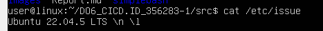
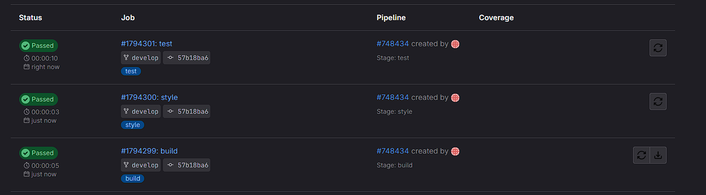

## Basic CI/CD

### Part 1. Настройка **gitlab-runner**

Подними виртуальную машину *Ubuntu Server 22.04 LTS*.




```
curl -L "https://packages.gitlab.com/install/repositories/runner/gitlab-runner/script.deb.sh" | sudo bash
sudo apt-get install gitlab-runner
```

Скачай и установи на виртуальную машину **gitlab-runner**.


Запусти **gitlab-runner** и зарегистрируй его для использования в текущем проекте (*DO6\_CICD*).

```
sudo gitlab-runner register
```


### Part 2. Сборка

В ветке **develop** cоздается файл *gitlab-ci.yml*, файл описывает процедуры CI/CD состоит из этапов: **build, style, test, deploy**.


##### Этап запуска сборки через мейк файл из проекта *Simple Bash*.


### Part 3. Тест кодстайла

Этап для **CI**, который запускает скрипт кодстайла (*clang-format*).


### Part 4. Интеграционные тесты

Этап запускается автоматически только при условии, если сборка и тест кодстайла прошли успешно *needs: - style - build*





